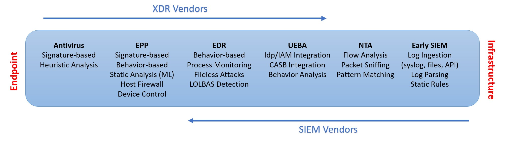

> Disclosure of potential bias
> 
> While I have made an effort to provide an unbiased account on this subject, the reader must be aware that I have built and currently manage a large SIEM deployment across more than 100 organizations [TBD]

Every now and then, I get approached by a coworker or a client asking questions about the ever-expanding list of security tools (EPP, EDR, NTA, HIPS, HIDS, UBA, UEBA, SIEM, XDR, SASE, etc.), what they mean, and how they differ from one another. Usually I have had no trouble explaining what each one of them is, delving deep into the evolution and convergence of EPP and EDR tools, explaining where SIEM and MDR fit in, and speculating about SASE solutions ultimately replacing permieter firewalls. But when it gets to XDR, things get a bit weird. Is it really a big enough technology worthy of having its own category? Or is it where log aggregation and SIEM technology have been going for nearly two decades? Is it a central repository of alerts from different log sources auto-magically correlating and bundling themselves into incidents? Or is there a team of human operators doing all that work like any MDR solution? Is it really the next best thing or just a smart marketing move by some venodrs?

To answer these questions, we need to do quick review of the evolution of protection, detection, and response tools across endpoints, network nodes, and the cloud. 

## Endpoint Security: From Antivirus to EPP and EDR
I will to spare you the story of self-replicating programs and the orogins of computer virus going all the way back to the 70's; you can find a great overview of that on wikipedia [1]. Let's skip all that and fast forward to the 80's when the first **Antivirus** programs were created. These were good old Dr. Solomon's Antivirus Toolkit, Norton Antivirus, McAfee Antivirus, and all the other security programs we all grew up with back in the late 80's and early 90's when things were simple. Their main job was to scan your hard drive for malware. They would do this by comparing files against a local database of known-bad hashes, or looking for certain patterns and strings (similar to today's IOCs) inside these files. Later on, many vendors added heuristic analyasis to detect new variants of viruses without relying on exact signatures and patterns [2].

Over time, the word *malware* replaced virus, becaming an umbrella term covering all the different catogories of malicious programs: viruses, rootkits, adware, spyware, potentially unwanted programs (PUP), and worms. Around the same time, Antivirus vendors started adding some additional features such as Host Firewall, Device Control, and Web Traffic Filtering. They moved away from the rather narrow and specific term Antivirus, to the broader and more aptly named **Endpoint Protection (EPP)**. These were your Symantec Endpoint Protection, ESET, WebRoot, etc. Sometime around 2016, a company called Cylance shook the industry by releasing an AI-driven antivirus solution, propelling the industry toward **NextGen** Endpoint Protection. Most legacy EPP vendors quickly followed suit and added ML functionalities of their own.

Then came CarbonBlack and CrowdStrike, with the valid claim that many malware-less attacks can go right past your NextGen EPP solution if you're not looking at process-related suspicious activity. Examples of these are Living Off the Land techniques such as using Powershell scripts, strange process trees (WinWord.exe spawning cmd.exe), processes running from the Recycle Bin, and so on. This led to the birth of **Endpoint Detection and Response (EDR)** technology. The core idea here is that there is a grey area where categorically blocking the activity could wreak havoc on you systems, and you'll end up with very unhappy developers and sysadmins. EDR's main goal was to detect the suspicious activity and report it to your IT team or dedicated SOC for further investigation.

Over the next few years, EDR makers such as CarbonBlack and CrowdStrike started adding more EPP features such as static analysis, signature scans, device control, and firewall management, while EPP vendors such as Symantec and Cylance started to build more EDR-like toolset into their products. This further blurred the lines between EPP and EDR [3]. Today, most endpoint protection startups design products with the full EPP and EDR spectrum from the get-go.

## Network Security: Firewalls, IPS, IDS, and NTA
Now let's shift our focus away from endpoints and zoom in on network infrastructure. Until recently, most employees used to work in brick and mortar offices, using workstations plugged into the corporate network, with all their traffic traversing through the perimeter firewalls. Traditional firewalls such as Cisco PIX, Cisco ASA, or older Fortinet FortiGate devices couldn't see beyond layer 4, which means that you had no control over ingress or egress traffic beyond IP addresses and port numbers. 

Technologies like deep-packet-inspection and SSL decryption were computationally expensive, so larger organizations would rely on **Network Intrusion Prevention Systems (NIPS)** or out-of-band **Network Intrusion Detection Systems (NIDS)** solutions to offload this workload to dedicated appliances. The problem with most of these technologies was that they required physical connectivity to every firewall and core switch in order to fully capture the data. As a result, **Netowrk Traffic Analysis** solutions that relied on technologies such as NetFlow or erSPAN were devised. 

Over time, companies like Palo Alto managed to successfully converge the NIPS featureset into their devices, creating what we know as **NextGen Firewalls**. The advent of NextGen Firewalls, and the increase in remote work and cloud applications essentially brought upon the death of NIDS/NIPS solutions, but NTA is still alive and kicking in many organizations.

## SIEM: The Battle for Single Page of Glass 
The idea of log aggregation, parsing and analysis is nothing new in IT; but SIEM didn't really become a *thing* until late 2000's. The idea here is that you ship the logs from everything we already discussed above (EPP, EDR, NTA, etc.), as well as OS and application logs, through a set of ingest pipelines that parse, enrich, and denormalize the data, to a central repository where they can be searched against and retained for a relatively long period of time. Once the data is in the SIEM, you can then use a combination of static rules or ML jobs to look for anomalous activity on your endpoints, applications, network devices, e-mail system, and so on. Consequently, your SOC team no longer has to get bombarded by e-mails alerts from a plethora of different technologies, or log in to dozens of different dashboards for doing investigations. They'll have one place to go: the SIEM.

First generation SIEM solutions were more focused towards log retention for compliance reasons, rather than incident detection and response. Modern SIEM solutions such as the one offered by Elastic, offer hundreds of pre-built detection rules, dozens of dashboards, event correlation functionality (see EQL), and machine learning jobs. Furthermore, you can install EDR-like agents on your endpoints to capture not only event logs, but also process and file informatino using tools such as Sysmon or Auditbeat. You can also leverage NTA functionality by levering syslog, NetFlow, or even port mirroring to a host running Zeek(bro). You can also use API calls to capture logs from essentially any modern hosted application and cloud platform. My area of expertise is mostly in BELK (Beats, Elasticsearch, Logstash, Kibana), but I know these are all possible on Splunk and other major SIEM solutions.

Some organizations further automate their incident reponse by integrating their SIEM into a **SOAR (Security Orchestration, Automation, and Response)** tool. These tools either simplify or automate certain aspects of SOC response, such as using SIEM alerts to blacklist an attacker's IP address on the perimeter firewall, create a DNS sinkhole, or isolate an endpoint.

## So what's XDR?

The term **eXtended Detection and Response (XDR)** is very new. It was coined by Nir Zuk of Palo Alto Networks in a keynote speech back in 2018.  The easiest way for me to explain this is by describing a hypthetical dialogue between our favorite security experts, Bob and Alice. 

Alice - So what is an XDR? 
Bob - It's like an EDR but it also monitors your network gear and cloud platforms. 
Alice - So it's kind of like a SIEM? 
Bob - Kind of... but SIEM doesn't really focus on endpoints, it doesn't care about running processes or suspicious behavior, it just ingests logs. 
Alice - Depends on the SIEM though... For example Splunk, Elastic, and AlienVault have endpoint agents that ingest event logs, syslog, process info, network traffic, and file integrity data, either using built-in modules or by leveraging things like Sysmon, Auditd, osquery, etc. 
Bob - True, but they don't have the endpoint protection (EPP) component, so it's all detection only. With XDR, it's detection AND prevention. 
Alice - Yeah but I've heard SIEM vendors are ramping up on that area too, Elastic Agents have EPP components for examples... so it's just a matter of time... 
Bob - Yeah, but also SIEM is better suited for compliance, not detection and response; whereas XDR is better at detecting suspcious activity using ML rules... 
Alice - That's really not the case anymore though, most modern SIEM tools have an extensive library of static detection rules and ML jobs these days. 
Bob - But they're mostly on-prem, XDR is a SaaS service. 
Alice - AlienVault is SaaS, then there's Splunk Cloud and Elastic Cloud, QRadar has a cloud offering too. 
Bob - ... 
Alice - So what really is the difference between SIEM and XDR?

Let's start with Gartner's definiton for XDR.

> “a SaaS-based, vendor-specific, security threat detection and incident response tool that natively integrates multiple security products into a cohesive security operations system that unifies all licensed components.”

Sounds familiar? If you remove "vendor-specific" from the description above, the rest of that statement describes a subset of what any SIEM tool already provides out of the box. Does any of that really warrant coming up with yet another acronym and further complicating matters for engineers and business professionals alike? 

To further clarify things for myself, I started breaking down the main components of each of each toolset in order to see how much overlap we're dealing with. I have used a bold typeface for core components, and italic for the additional features I've seen across different products.

|               | EPP                 | EDR                    | NDR            | XDR                      | SIEM                         |
| ---           | ---                 | ---                    | ---            | ---                      | ---                          |
| Endpoints     | **AM**, *DC*, *HFW* | **HIDS**, **PM**, *AM* |                | **AM**, **HIDS**, **PM** | **LC**, **LR**, *HIDS*, *PM* |
| Network Nodes |                     |                        | **NIDS**, *LC* | **NIDS**, *LC*           | **LC**, **LR**, **NIDS**     |
| Applications  |                     |                        |                | *LC*                     | **LC**, **LR**               |
| Cloud         |                     |                        |                | *LC*                     | **LC**, **LR**               |

AM: Anti-Malware 
PM: Process Monitoring 
DC: Device Control 
HFW: Host Firewall 
HIDS: Host Intrusion Detection System 
NIDS: Network Intrustion Detection System 
LC: Log Collection 
LR: Log Retention 

It's quite clear that SIEM and XDR have a great amount of overlap. Does that make XDR and SIEM the same? No, at least not yet. Even though the two categories are very similar, XDR is still closer to the endpoint since it has its roots in EPP and EDR technology. If you look at the brochures and marketing information of XDR products, almost all of them have a mature antivirus/EDR component with integrations with a handful of infrastructure and cloud platforms. That's nothing compared to th plethors of integration modules offered by the likes of Splunk, Qradar, and Elastic. But can you really blame them for having a dream? Or can you blame them for coming up with a new name that is sexier than SIEM, a term that has sadly become equivant to "complex", and "costly"? I wouldn't. But do you think a company an EPP company can build a parser like Logstash and a platform that can scale to thousands of nodes, terabytes of data, and be able to run a search for an IOC in your Apache logs going back a year and tell you if you were ever hit by a zeroday webshell attack that's been just discovered? Or can it parse your multiline custom application log that's not JSON or CSV or CEF, and uses a weird timestamp? I doubt it.

This is also true for the SIEM vendors; they have also been trying to push into the Endpoint market. A prime example of this is Elastic. They started with detect-only Beats for things like logs, processes, and network connections, but have recently entered the endpoint protection market by acquiring EndGame to release Elastic Agent. But would a SIEM vendor be able to detect a hypervisor rootkit or something that has injected itself into your MBR or UEFI partition? Maybe, who knows!

[1] https://en.wikipedia.org/wiki/Computer_virus, 'Computer Virus' 
[2] https://cs.stanford.edu/people/eroberts/cs181/projects/2000-01/viruses/anti-virus.html, 'How Anti-Virus Software Works' 
[3] https://www.gartner.com/imagesrv/media-products/pdf/symantec/symantec-1-4SNI36O.pdf?es_p=6816496, 'The Evolution of Endpoint Protection' 
